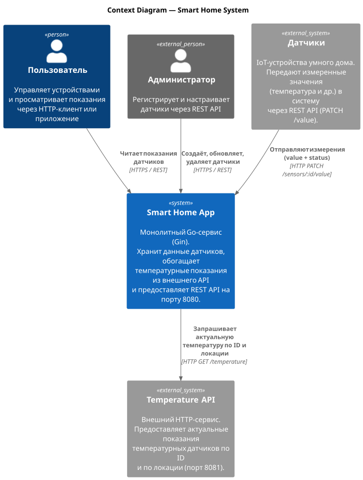
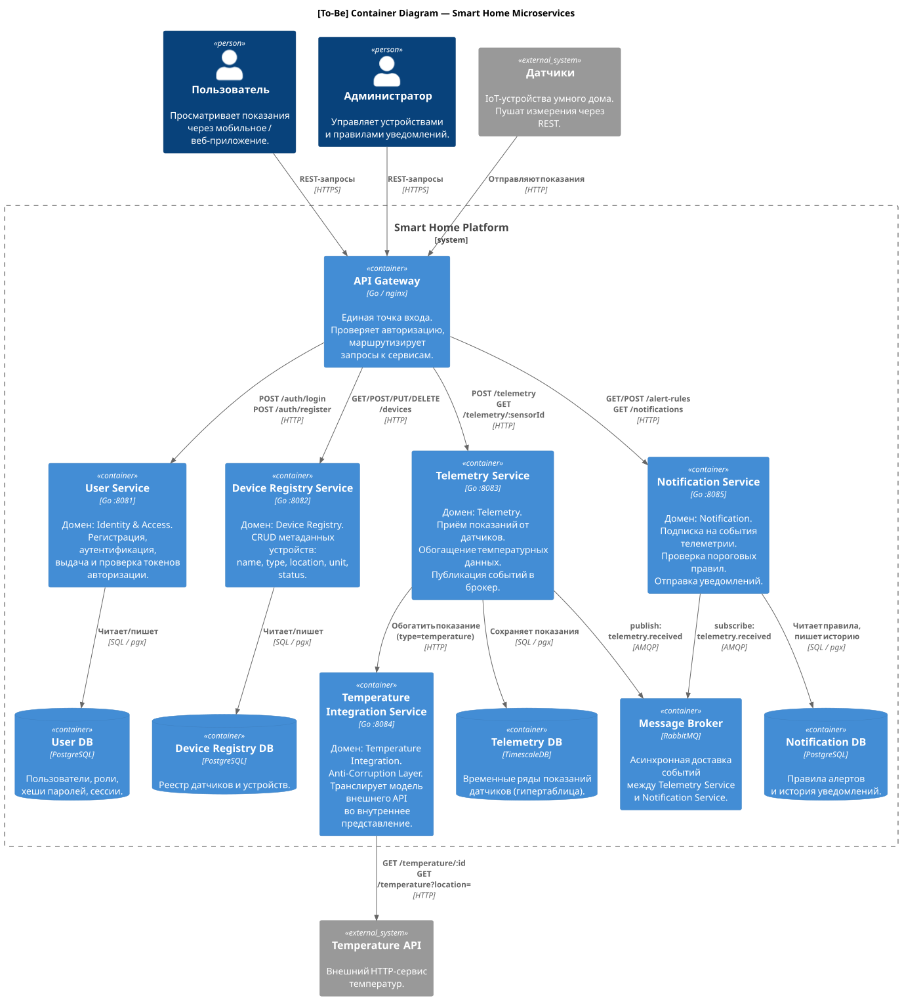

# Project_template

Это шаблон для решения проектной работы. Структура этого файла повторяет структуру заданий. Заполняйте его по мере работы над решением.

# Задание 1. Анализ и планирование

### 1. Описание функциональности монолитного приложения

**Управление отоплением:**

- Пользователи могут создавать, просматривать, обновлять и удалять датчики
- Система поддерживает датчики с атрибутами: название, тип, локация, значение, единица измерения, статус

**Мониторинг температуры:**

- Пользователи могут получать актуальные показания температурных датчиков
- Система обращается к внешнему Temperature API и обновляет данные датчика в реальном времени при каждом запросе

### 2. Анализ архитектуры монолитного приложения

- Язык: Go
- База данных: PostgreSQL
- Вся бизнес-логика в одном сервисе: обработка запросов, работа с БД, обращение к внешнему API
- Для температурных датчиков приложение синхронно обращается к внешнему Temperature API при каждом запросе

### 3. Определение доменов и границы контекстов

Выделены следующие домены:

- **Identity & Access** — аутентификация и управление пользователями
- **Device Registry** — реестр устройств и датчиков
- **Telemetry** — приём и хранение показаний датчиков
- **Temperature Integration** — изоляция внешнего Temperature API (Anti-Corruption Layer)
- **Notification** — правила алертов и отправка уведомлений

### **4. Проблемы монолитного решения**

- Падение любого компонента вызывает падение всей системы
- Нельзя отдельно масштабировать приём показаний без масштабирования всего приложения
- Нет аутентификации

### 5. Визуализация контекста системы — диаграмма С4

[C4 Context](diagrams/c4-context.svg)

# Задание 2. Проектирование микросервисной архитектуры

**Диаграмма контейнеров (Containers)**

[C4 Containers To-Be](diagrams/c4-containers-to-be.svg)

**Диаграмма компонентов (Components)**

[User Service](diagrams/components/c4-components-user-service.svg)

[Device Registry Service](diagrams/components/c4-components-device-registry.svg)

[Telemetry Service](diagrams/components/c4-components-telemetry.svg)

[Temperature Integration Service](diagrams/components/c4-components-temperature-integration.svg)

[Notification Service](diagrams/components/c4-components-notification.svg)

**Диаграмма кода (Code)**

[Telemetry Ingestion](diagrams/code/uml-telemetry-ingestion.svg)

[Alert Rule Engine](diagrams/code/uml-alert-rule-engine.svg)

# Задание 3. Разработка ER-диаграммы

[ER Diagram](diagrams/er-diagram.svg)

# Задание 4. Создание и документирование API

### 1. Тип API

- **REST API** — для взаимодействия между клиентами и сервисами (создание датчиков, получение показаний, управление правилами алертов).
- **AsyncAPI (AMQP / RabbitMQ)** — для асинхронного взаимодействия между Telemetry Service и Notification Service. Telemetry Service публикует события, Notification Service подписывается на канал и проверяет правила алертов. Таким образом, Notification Service не блокирует запись показаний.

### 2. Документация API

[REST API — OpenAPI](api/openapi.yaml)

[Async API — AsyncAPI](api/asyncapi.yaml)

# Задание 5. Работа с docker и docker-compose

[temperature-api](apps/temperature_api/main.go)

[docker-compose](apps/docker-compose.yml)